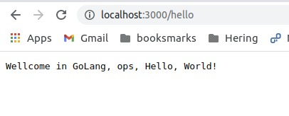

# Hello, World!

Let's get started on our web application. As usual, this is going to be a very simple "Hello, World!" app, because I want to focus on the development and deployment process.


## GO INIT

To create our new project, we need to create a directory for it, and use the go mod init command to initialize it as a Go module.

```bash
    mkdir helloworld
    cd helloworld
    go mod init hugoalmeidahh/helloworld
```


It's common practice to use your github username to keep your project names globally unique, and avoid name conflicts with any of your project dependencies, but you can use any name you like.

You'll see a go.mod file in the directory now. This is where Go will track any project dependencies. If you look at the contents of the file, they should look something like this:


``` Go
    module hugoalmeidahh/helloworld

    go 1.15
```


## gin
We're going to use gin for our web application. Gin is a lightweight web framework, similar to Sinatra for Ruby, express.js for Javascript, or Flask for Python.

``` Go
    r := gin.Default()
```
This creates a router object, r, using the built-in defaults that come with gin.

Then, we assign a handler function to be called for any HTTP GET requests to the path /hello, and to return the string "Hello, World!" and a 200 (HTTP OK) status code:

``` Go  
    r.GET("/hello", func(c *gin.Context) {
		c.String(200, "Hello, World!")
	})
```

Finally, we start our webserver and tell it to listen on port 3000:

``` Go
    r.Run(":3000")
```
To run this code, execute:

``` bash
    go run hello.go
```




# Hey, see this

Note that we don't need to install gin separately, or even edit our go.mod file to declare it as a dependency. 

Go finds this out and makes the necessary changes for us.

If you look at the go.mod file, you'll see it now contains this:

``` Go
    module hugoalmeidahh/helloworld

    go 1.15

    require github.com/gin-gonic/gin v1.6.3 // indirect
```

You will also see a go.sum file now. This is a text file containing references to the specific versions of all the package dependencies, and their dependencies, along with a cryptographic hash of the contents of that version of the relevant module.

The *go.sum* file serves a similar function to package-lock.json for a Javascript project, or Gemfile.lock in a Ruby project, and you should always check it into version control along with your source code.

Let's do that now:


